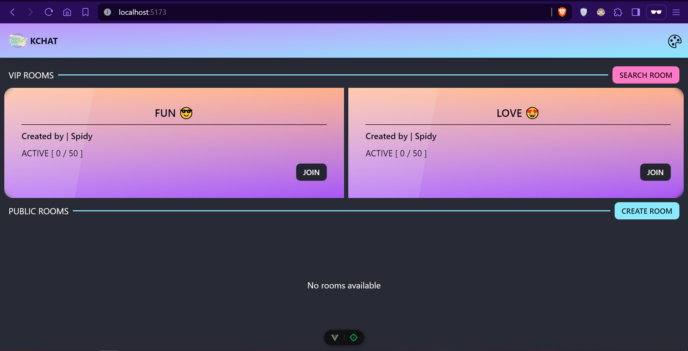
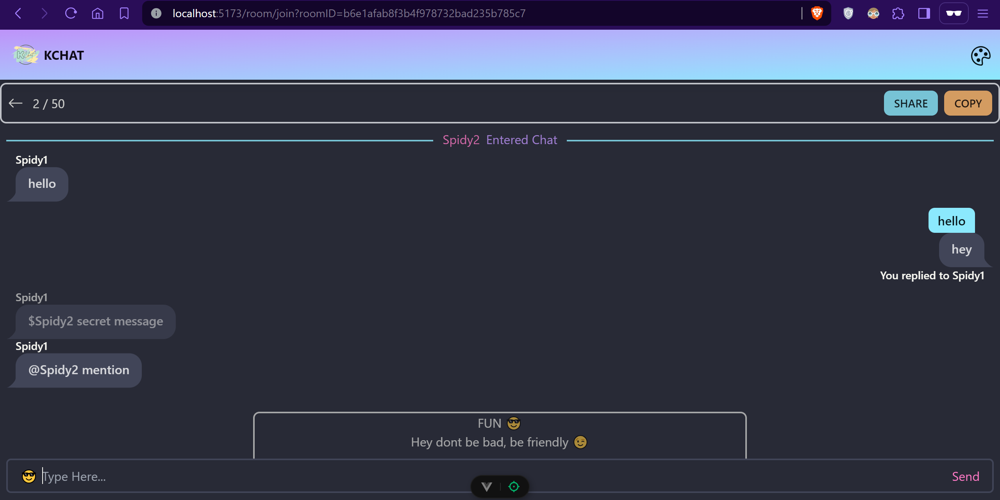
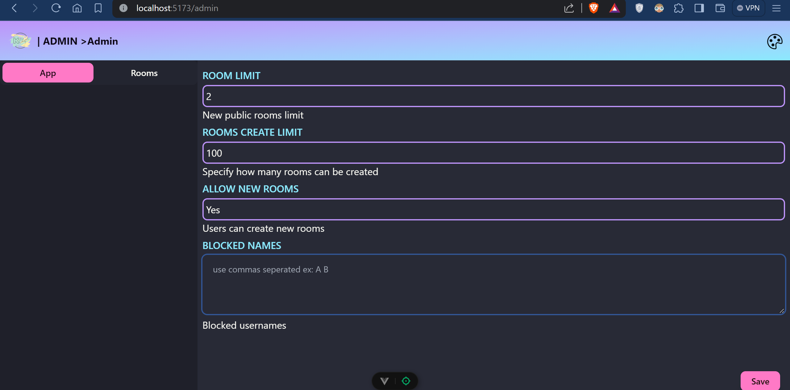

<div align="center">
  <h3 align="center">KCHAT</h3>

  <p align="center">
    A chatting application created with PYTHON and VUE
    <br />
</p>
</div>

<!-- TABLE OF CONTENTS -->
<details>
  <summary>Table of Contents</summary>
  <ol>
    <li>
      <a href="#about-the-project">About The Project</a>
    </li>
    <li>
      <a href="#getting-started">Getting Started</a>
      <ul>
        <li><a href="#prerequisites">Prerequisites</a></li>
        <li><a href="#installation">Installation</a></li>
      </ul>
    </li>
    <li><a href="#roadmap">Roadmap</a></li>
  </ol>
</details>

<!-- ABOUT THE PROJECT -->

## About The Project

A chat app build without database using python and vue, I created this for fun 😃





<!-- GETTING STARTED -->

## Getting Started

First lets install backend and then frontend

### Prerequisites

You need python and nodejs

### Installation

First clone the repository

- Install
  - backend
  ```sh
  pip install -r requirements.txt
  # start server
  uvicorn main:app --reload
  ```
  - frontend
  ```sh
  # change directory
  cd web
  # use any npm or pnpm
  pnpm install
  # start server
  pnpm dev
  ```
  Now visit http://localhost:5173

## Roadmap

- [ ] Add random chat
- [ ] Admin site implements
